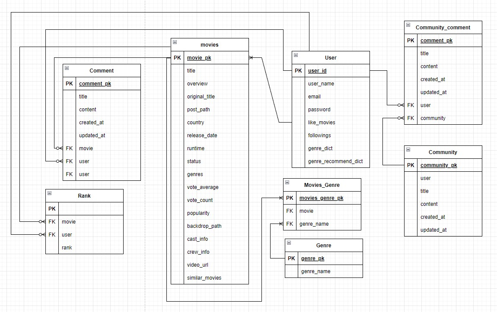

# Final Project

## 1. 팀원 정보 및 업무 분담 내역


## 2. 목표 서비스 구현 및 실제 구현 정도


## 3. 데이터베이스 모델링 (ERD)




## 4. 영화 추천 알고리즘에 대한 기술적 설명

* 사용자가 좋아하는 영화 데이터를 바탕으로 선호 장르 분석 (백엔드-장고)
  
  1. 틴더 및 영화 디테일 페이지에서 좋아요 버튼 클릭 
  
  2. 해당 영화의 장르에 대한 선호도 점수를 유저 정보에 저장
  
  3. 장르 선호도 Top3 Pick 
     
     : 이중 for문과 비교를 이용하여 1위, 2위, 3위 설정
     
     : 공동 순위 발생 시 기존의 값이 우선 순위
     
      (순서가 없다는 딕셔너리의 특징으로 기존 값이 우선 순위라고 고정해도 for문을 돌때 순서가 변경되어 사용자에게 다양한 영화 추천 가능 )
  
  4. Top3 장르의 선호도 점수 비율로 변환
  
  5. 추천할 영화 50개를 (4)에서 구한 비율로 장르 분배
  
  6. 이를 {장르1: 영화수, 장르2: 영화수, 장르3: 영화수} 딕셔너리 형태로 user 정보에 저장 (genre_recommend_dict)

```javascript
import random
import math
@api_view(['GET'])
# @authentication_classes([JSONWebTokenAuthentication])
# @permission_classes([IsAuthenticated])
def recommend(request):
    username = request.user.username
    person = get_object_or_404(get_user_model(), username=username)
    person_genre_dict = person.genre_dict
    

    # 장르 선호 순으로 배열 [1등, 2등, 3등] = [[장르, 점수], [장르, 점수], [장르, 점수]]
    person_genre = [[0, 0], [0, 0], [0, 0]]
    for key, val in person_genre_dict.items():
        for grade in range(3):
            if person_genre[grade][1] < val:
                person_genre[grade][0] = key
                person_genre[grade][1] = val
                break
            elif person_genre[grade][1] == val:
                if (grade == 0 or grade == 1) and person_genre[grade + 1][1] != val:
                    person_genre[grade][0] = key
                    person_genre[grade][1] = val
                    break
                person_genre[grade][0] = key
                person_genre[grade][1] = val
               

    
    # 각 등수별 불러올 영화수
    total = person_genre[0][1] + person_genre[1][1] + person_genre[2][1]
    first_cnt = round((person_genre[0][1] / total) * 50)
    second_cnt = round((person_genre[1][1] / total) * 50)
    third_cnt = round((person_genre[2][1] / total) * 50)
    if first_cnt + second_cnt + third_cnt > 50:
        first_cnt -= abs(50 - (first_cnt + second_cnt + third_cnt))
    elif first_cnt + second_cnt + third_cnt < 50:
        first_cnt += abs(50 - (first_cnt + second_cnt + third_cnt))
    

    person.genre_recommend_dict = {}
    person.genre_recommend_dict[str(person_genre[0][0])] = first_cnt
    person.genre_recommend_dict[str(person_genre[1][0])] = second_cnt
    person.genre_recommend_dict[str(person_genre[2][0])] = third_cnt

    person.save()
    serializer = ProfileSerializer(person)
    return Response(serializer.data)
```

* Django에서 받은 데이터를 바탕으로 JS에서 getters에 회원 맞춤 영화 저장
  
  1. user에 저장된 genre_recommend_dict ({장르1: 영화수, 장르2: 영화수, 장르3: 영화수}) 순회
  
  2. 해당 장르와 일치하는 영화 우선 필터 
     
     - 임의 리스트에 하나씩 추가
  
  3. 영화의 중복을 막기 위한 조건문 추가
     
     * 한 영화에 장르가 여러개가 있는 경우가 많으므로 장르별로 영화를 뽑을 때 중복된 경우가 많음
     - 이미 추가되어 있는 영화는 더이상 추가하지 않는다.
  
  4. 해당 장르(key값)의 영화를 저장된 영화 수(value)만큼 랜덤으로 뽑기
     
     - lodash의 _.sampleSize(배열, 갯수) 이용
  
  5. 장르별로 pick한 영화 리스트 3개를 하나의 리스트로 합하기
     
     - Spread Syntax 이용
     
     - 최종리스트.push(...3개의 장르 리스트 각각)

```javascript
// store/index.js

// 회원 맞춤 영화
    getRecommendMovie(state) {
      const getRecommendMovie = []
      for (const genre_id in state.user.genre_recommend_dict) {
        // console.log(genre_id)
        const recMovie = state.movies.filter((movie) => {
          // console.log(movie.genres)
          if (movie.genres.includes(Number(genre_id))) {
            return !getRecommendMovie.includes(movie)
          }
        })
        // console.log(recMovie)
        getRecommendMovie.push(..._.sampleSize(recMovie, state.user.genre_recommend_dict[genre_id]))
      }
      return getRecommendMovie
    },
```


## 5. 서비스 대표 기능에 대한 설명


6. ~~배포 서버 URL (배포했을 경우)~~


## 7. 기타 (느낀 점, 후기 등)
